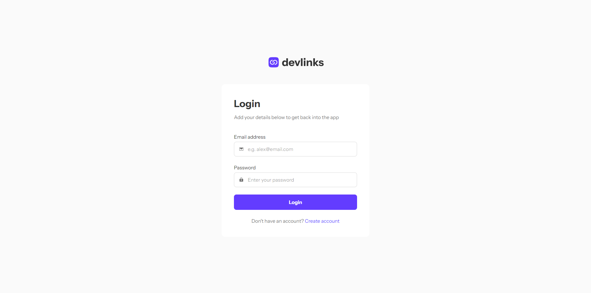
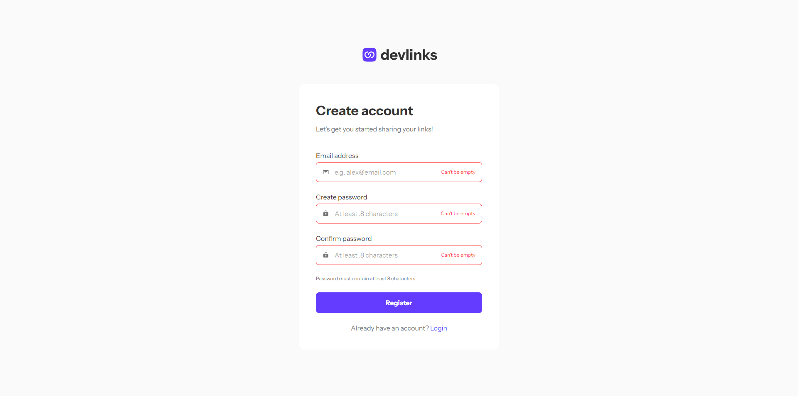
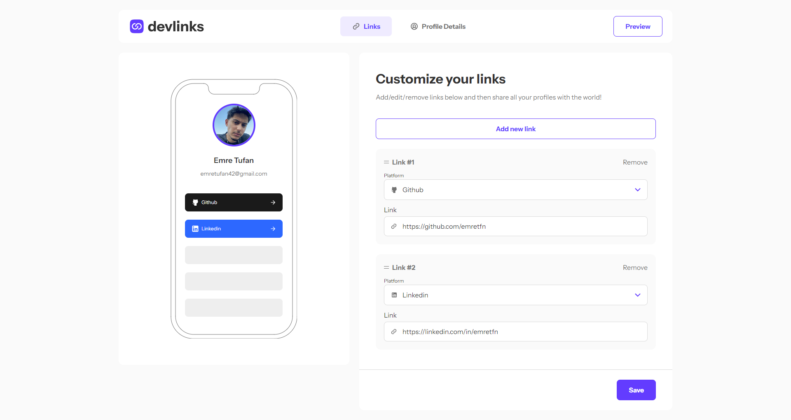
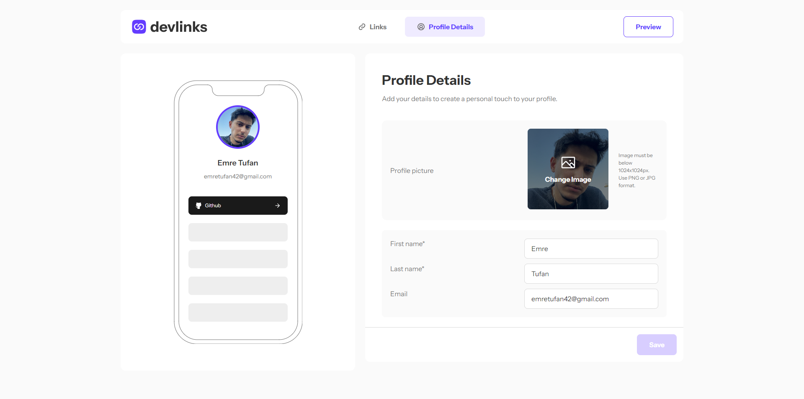
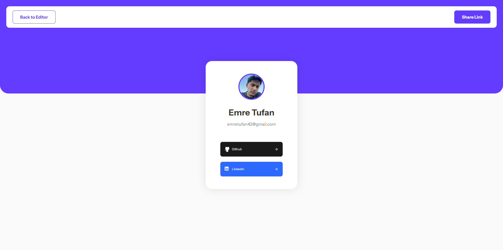

# Frontend Mentor - Link-sharing app solution

This is a solution to the [Link-sharing app challenge on Frontend Mentor](https://www.frontendmentor.io/challenges/linksharing-app-Fbt7yweGsT). Frontend Mentor challenges help you improve your coding skills by building realistic projects.

## Table of contents

- [Overview](#overview)
  - [The challenge](#the-challenge)
  - [Screenshot](#screenshot)
  - [Links](#links)
- [My process](#my-process)
  - [Built with](#built-with)
  - [What I learned](#what-i-learned)
  - [Continued development](#continued-development)
- [Author](#author)

**Note: Delete this note and update the table of contents based on what sections you keep.**

## Overview

### The challenge

Users should be able to:

- Create, read, update, delete links and see previews in the mobile mockup
- Receive validations if the links form is submitted without a URL or with the wrong URL pattern for the platform
- Drag and drop links to reorder them
- Add profile details like profile picture, first name, last name, and email
- Receive validations if the profile details form is saved with no first or last name
- Preview their devlinks profile and copy the link to their clipboard
- View the optimal layout for the interface depending on their device's screen size
- See hover and focus states for all interactive elements on the page
- **Bonus**: Save details to a database (build the project as a full-stack app)
- **Bonus**: Create an account and log in (add user authentication to the full-stack app)

### Screenshot







### Links

- [Solution URL](https://www.frontendmentor.io/solutions/link-sharing-app-If7HW9-ksw)
- [Live site URL](https://link-sharing.emretufan.dev)

## My process

### Built with

- Nextjs
- Supabase
- Tailwindcss
- Zustand

### What I learned

One of the hardest parts was creating a dynamic form and showing the social media links that were shown instantly on the phone mockup. After some research, I found useFieldArray in react-hook-form, which made it much easier to create a dynamic form. I also used the watch feature from react-hook-form to keep the latest information in the store with zustand and show the necessary information on the phone mockup.

```tsx
const methods = useForm<SocialLinkForm>({
  resolver: zodResolver(SocialLinkSchema),
});
const {
  getValues,
  reset,
  handleSubmit,
  formState: { isDirty },
  control,
  watch,
} = methods;

const { fields, append, remove, move } = useFieldArray<SocialLinkForm>({
  control,
  name: "socialLinks",
});
```

```tsx
useEffect(() => {
  const subscription = watch((value) => {
    setSocialLinks(value.socialLinks as any);
  });

  return () => subscription.unsubscribe();
}, [watch]);
```

Apart from that, creating RLS (Row Level Security) on Supabase was a bit difficult for me. But I think I have increased the security of the application by creating RLS policies.

### Continued development

I want to focus on unit tests and e2e tests in the future. I will try to add these tests to this project as much as I can. I plan to use Jest in unit tests and cypress in e2e tests and focus on them.

## Author

- Frontend Mentor - [@emretfn](https://www.frontendmentor.io/profile/emretfn)
- Twitter - [@tfnemree](https://www.twitter.com/tfnemree)
